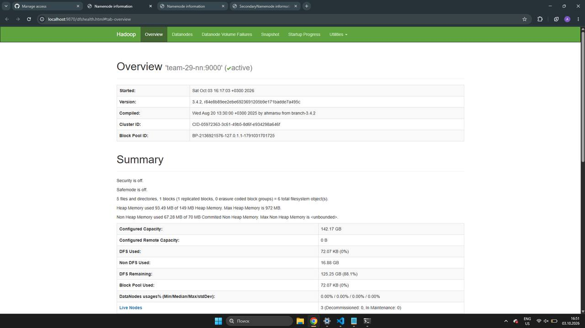
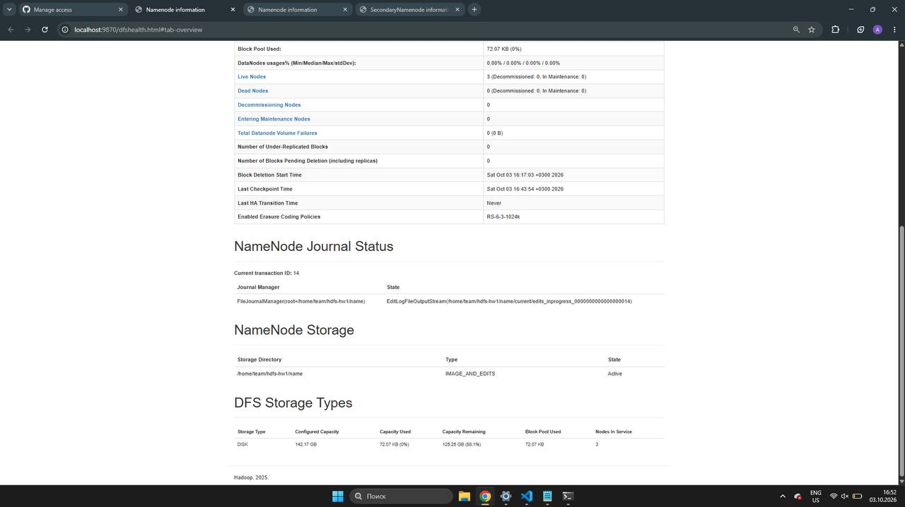
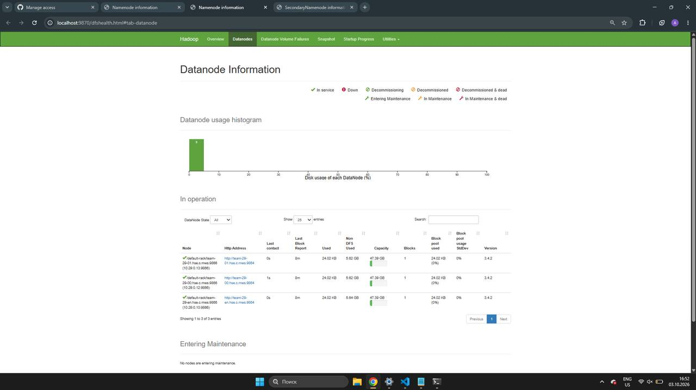
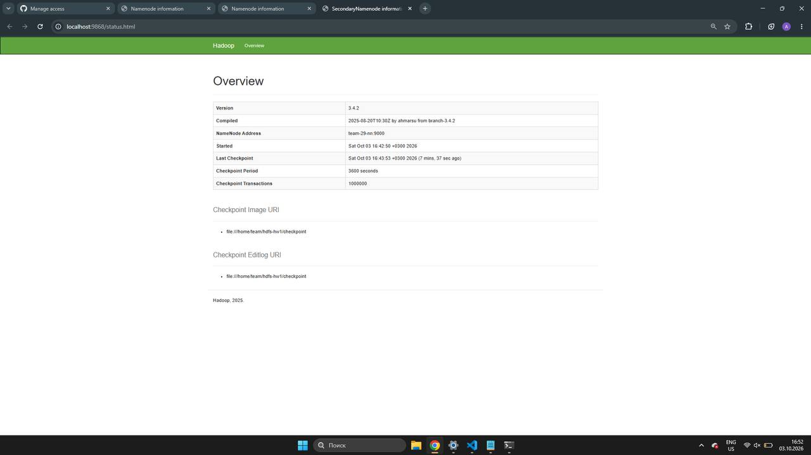

# ДЗ1. Введение в платформы данных

Развертывание HDFS кластера из одного NameNode, одного Secondary NameNode и трех DataNode.

## Участники

| ФИО | Telegram | GitHub |
| --- | --- | --- |
| Соленникова София Сергеевна | @an_soc | [poskrebish](https://github.com/poskrebish) |
| Маликова Полина Михайловна | @pomalkv | [pmmalikova](https://github.com/pmmalikova) |
| Пушкарева Анастасия Эдуардовна | @nonetrait | |
| Уткина Анастасия Михайловна | @aytsantu | [UtkinaAM](https://github.com/UtkinaAM) |

## Архитектура

| Узел | IP | Роль |
| --- | --- | --- |
| team-29-en | 10.29.0.10 | Edge, DataNode, Secondary NameNode |
| team-29-nn | 10.29.0.11 | NameNode |
| team-29-00 | 10.29.0.12 | DataNode |
| team-29-01 | 10.29.0.13 | DataNode |

NameNode хранит метаданные HDFS, а DataNode хранят блоки файлов. Secondary NameNode делает checkpoint метаданных и не является резервным NameNode.

Replication factor равен 3. В кластере три DataNode, чтобы хранить по три реплики каждого блока.

## Среда

- Ubuntu 24.04.5 LTS;
- x86_64;
- 2 CPU на узел;
- около 3.8 GiB RAM на узел;
- диск около 48 GB на узел;
- пользователь `team`;
- OpenJDK 11;
- Hadoop 3.4.2.

| Назначение | Путь |
| --- | --- |
| Hadoop | `$HOME/hadoop-hw1` |
| NameNode | `$HOME/hdfs-hw1/name` |
| DataNode | `$HOME/hdfs-hw1/data` |
| Secondary NameNode checkpoint | `$HOME/hdfs-hw1/checkpoint` |

## Структура проекта

```text
hw1/
├── README.md
├── configs/
│   ├── core-site.xml
│   ├── hdfs-site.xml
│   └── workers
├── scripts/
│   ├── check.sh
│   ├── deploy.sh
│   ├── install-node.sh
│   ├── start.sh
│   └── stop.sh
├── results/
└── screenshots/
```

- `configs/`: конфигурация Hadoop.
- `scripts/`: установка, запуск, остановка и проверка.
- `results/`: результаты автоматической проверки.
- `screenshots/`: скриншоты Web UI.

## Основные настройки

| Параметр | Значение |
| --- | --- |
| `fs.defaultFS` | `hdfs://team-29-nn:9000` |
| `dfs.replication` | `3` |
| NameNode Web UI | `team-29-nn:9870` |
| Secondary NameNode Web UI | `team-29-en:9868` |

NameNode настроен слушать сетевые интерфейсы через bind host `0.0.0.0`, чтобы к нему могли подключаться остальные узлы.

## Развертывание

Команды развертывания выполняются с edge-узла `team-29-en`. Для доступа к внутренним узлам используется ключ `$HOME/.ssh/team_internal`.

Подключение:

```bash
ssh team@2.59.82.111
```

Переход в уже клонированный репозиторий и его обновление:

```bash
cd ~/data_platforms_team_29
git pull
cd hw1
```

Запуск развертывания:

```bash
bash scripts/deploy.sh
```

`deploy.sh` устанавливает Java и Hadoop на всех четырех узлах, копирует конфигурацию на внутренние узлы и настраивает Hadoop. NameNode форматируется только при первом запуске. Затем скрипт перезапускает процессы: NameNode, три DataNode и Secondary NameNode.

Если `$HOME/hdfs-hw1/name/current/VERSION` уже существует, форматирование пропускается. Если каталог NameNode не пуст, но `VERSION` отсутствует, скрипт завершается с ошибкой и ничего не удаляет.

## Запуск и остановка

Команды выполняются на edge из каталога `hw1`. Запуск:

```bash
bash scripts/start.sh
```

`start.sh` не запускает повторно уже работающий процесс.

Остановка:

```bash
bash scripts/stop.sh
```

## Проверка

После развертывания на edge из каталога `hw1` выполнить:

```bash
bash scripts/check.sh
```

Скрипт проверяет:

- NameNode;
- Secondary NameNode;
- три DataNode;
- количество Live DataNode и отсутствие Dead DataNode;
- запись тестового файла `/user/team/hw1/test.txt` в HDFS;
- чтение файла и совпадение содержимого с `Hello, HDFS!`;
- три живые реплики тестового файла, `Live_repl=3`;
- состояние HDFS через `fsck` и наличие статуса `HEALTHY`.

Результаты сохраняются в файлы относительно каталога `hw1`:

- `results/jps.txt`;
- `results/dfsadmin-report.txt`;
- `results/fsck.txt`;
- `results/checkpoint.txt`.

В `checkpoint.txt` сохраняются статус Secondary NameNode и сведения из его лога. Отсутствие записи `Checkpoint done` не прерывает проверку.

## Web UI

Web UI открывается через SSH tunnel, так как узлы находятся во внутренней сети. На локальном компьютере выполнить в отдельном терминале:

```bash
ssh -N \
  -L 9870:team-29-nn:9870 \
  -L 9868:team-29-en:9868 \
  team@2.59.82.111
```

После запуска туннеля открыть:

- NameNode: [http://localhost:9870](http://localhost:9870);
- Secondary NameNode: [http://localhost:9868](http://localhost:9868).

На странице Datanodes в NameNode UI проверяется наличие трех Live DataNode и отсутствие Dead DataNode.

## Результат

- Все необходимые HDFS процессы запущены.
- Работают 3 DataNode, Dead DataNode отсутствуют.
- Все DataNode имеют статус Normal и не находятся в decommission.
- Тестовый файл `/user/team/hw1/test.txt` успешно записан и прочитан.
- Replication factor тестового файла равен 3, `Live_repl=3`.
- HDFS имеет статус `HEALTHY`.
- Under-replicated blocks: 0.
- Missing blocks: 0.
- Corrupt blocks: 0.
- Secondary NameNode работает.
- Checkpoint выполняется, что видно в Web UI Secondary NameNode.

`checkpoint.txt` сохранен до первого checkpoint. Время последнего checkpoint видно на скриншоте Web UI Secondary NameNode.

Файлы результатов:

- [jps.txt](results/jps.txt)
- [dfsadmin-report.txt](results/dfsadmin-report.txt)
- [fsck.txt](results/fsck.txt)
- [checkpoint.txt](results/checkpoint.txt)

## Скриншоты

### NameNode



### Состояние кластера



На скриншоте видно:

- Live Nodes: 3;
- Dead Nodes: 0;
- Decommissioning Nodes: 0;
- Under-Replicated Blocks: 0.

### DataNode



Видны три работающих DataNode.

### Secondary NameNode



Web UI показывает время последнего checkpoint.
