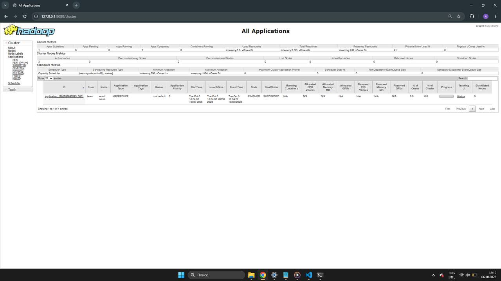
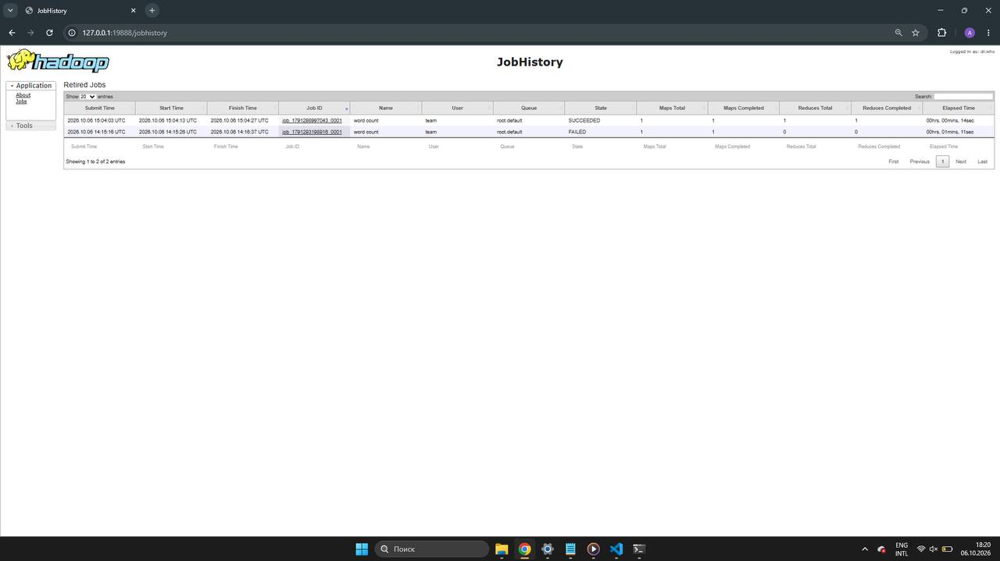
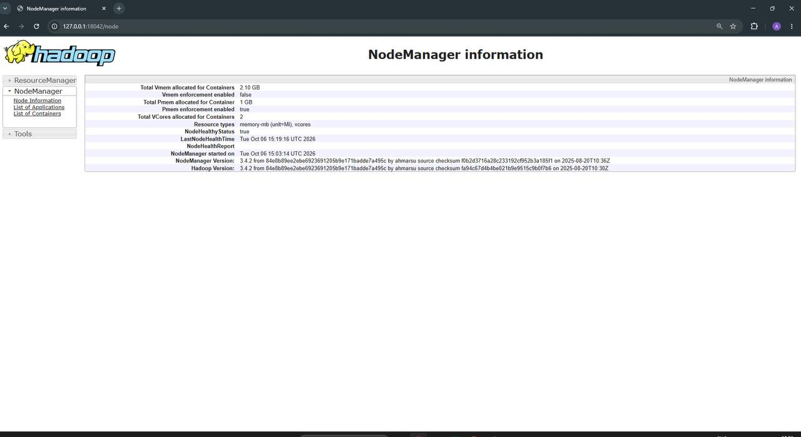
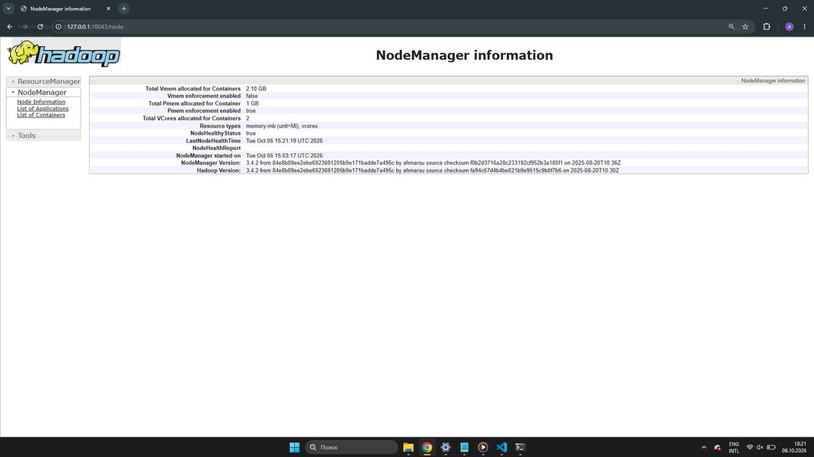
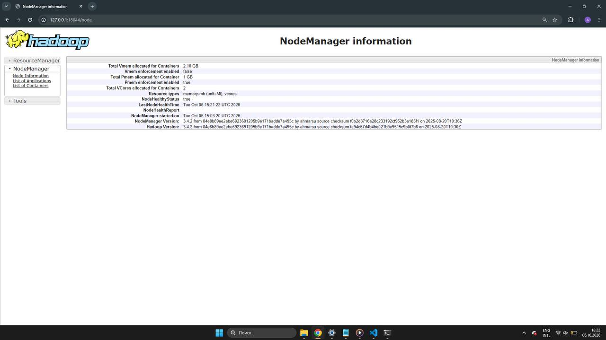

# ДЗ2. Введение в платформы данных

Поверх существующего HDFS-кластера из ДЗ1 развернут YARN. Запущены ResourceManager, три NodeManager и JobHistoryServer. Web UI опубликованы через nginx на edge-узле.

Web UI NameNode и Secondary NameNode были настроены и описаны в ДЗ1. В ДЗ2 дополнительно публикуются Web UI YARN и MapReduce: ResourceManager, JobHistoryServer и три NodeManager.

## Участники

| ФИО | Telegram | GitHub |
| --- | --- | --- |
| Соленникова София Сергеевна | @an_soc | [poskrebish](https://github.com/poskrebish) |
| Маликова Полина Михайловна | @pomalkv | [pmmalikova](https://github.com/pmmalikova) |
| Пушкарева Анастасия Эдуардовна | @nonetrait | [nonetrait](https://github.com/nonetrait) |
| Уткина Анастасия Михайловна | @aytsantu | [UtkinaAM](https://github.com/UtkinaAM) |

## Архитектура

| Узел | IP | Роль |
| --- | --- | --- |
| team-29-en | 10.29.0.10 | Edge, DataNode, Secondary NameNode, NodeManager, nginx |
| team-29-nn | 10.29.0.11 | NameNode, ResourceManager, JobHistoryServer |
| team-29-00 | 10.29.0.12 | DataNode, NodeManager |
| team-29-01 | 10.29.0.13 | DataNode, NodeManager |

ResourceManager управляет ресурсами YARN. NodeManager работают на трех узлах и запускают контейнеры задач. JobHistoryServer хранит историю MapReduce-задач. nginx на edge публикует Web UI внутренних сервисов.

## Среда

- Ubuntu 24.04.5 LTS;
- Hadoop 3.4.2;
- OpenJDK 11;
- пользователь `team`;
- Hadoop расположен в `/home/team/hadoop-hw1`;
- рабочие каталоги YARN находятся в `/home/team/yarn-hw2`.

Используется HDFS из ДЗ1. В ДЗ2 HDFS не переустанавливается и не форматируется.

## Структура проекта

```text
hw2/
├── README.md
├── configs/
│   ├── mapred-site.xml
│   ├── nginx-hw2.conf
│   └── yarn-site.xml
├── scripts/
│   ├── check.sh
│   ├── deploy.sh
│   ├── start.sh
│   └── stop.sh
├── results/
└── screenshots/
```

- `configs/`: конфигурация YARN, MapReduce и nginx.
- `scripts/`: развертывание, запуск, остановка и проверка.
- `results/`: результаты автоматической проверки.
- `screenshots/`: скриншоты Web UI после успешного развертывания.

## Основные настройки

| Параметр | Значение |
| --- | --- |
| ResourceManager Web UI | `team-29-nn:8088` |
| JobHistoryServer Web UI | `team-29-nn:19888` |
| JobHistoryServer RPC | `team-29-nn:10020` |
| NodeManager Web UI | `8042` |
| NodeManager memory | `1024 MB` |
| NodeManager vcores | `2` |
| MapReduce framework | `yarn` |
| ApplicationMaster memory | `512 MB` |
| Map memory | `512 MB` |
| Reduce memory | `512 MB` |

У ResourceManager, NodeManager и JobHistoryServer bind-host равен `0.0.0.0`. Для NodeManager включен `mapreduce_shuffle`.

`deploy.sh` настраивает `/etc/hosts` на NodeManager-узлах, чтобы hostname и FQDN разрешались во внутренние адреса `10.29.0.x`, а не в `127.0.1.1`. Это нужно для подключения контейнеров MapReduce к ApplicationMaster. Перед изменением создается резервная копия, после изменения оба имени проверяются через `getent ahostsv4`.

## Развертывание

Команды выполняются с edge-узла `team-29-en` от пользователя `team`. Перед запуском должен работать HDFS из ДЗ1. Для внутренних узлов используется ключ `$HOME/.ssh/team_internal`, а `sudo` должен работать без пароля.

Подключение:

```bash
ssh team@2.59.82.111
```

Переход в уже клонированный репозиторий и его обновление:

```bash
cd ~/data_platforms_team_29
git pull origin main
cd hw2
```

Запуск развертывания:

```bash
bash scripts/deploy.sh
```

`deploy.sh` проверяет существующий Hadoop 3.4.2, копирует настройки YARN и MapReduce на четыре узла, создает рабочие каталоги и настраивает разрешение имен на трех NodeManager. На edge устанавливается nginx, если его еще нет. Конфигурация nginx проверяется через `nginx -t`; при ошибке обновления восстанавливается предыдущий файл.

Затем скрипт перезапускает ResourceManager, JobHistoryServer и три NodeManager. Процессы HDFS продолжают работать.

## Запуск и остановка

Команды выполняются на edge из каталога `hw2`. Запуск:

```bash
bash scripts/start.sh
```

`start.sh` проверяет процессы через `jps` и не запускает повторно уже работающий процесс.

Остановка:

```bash
bash scripts/stop.sh
```

`stop.sh` останавливает только три NodeManager, JobHistoryServer и ResourceManager. Процессы HDFS и nginx остаются запущенными.

## Проверка

На edge из каталога `hw2` выполнить:

```bash
bash scripts/check.sh
```

Скрипт проверяет:

- ResourceManager и JobHistoryServer на `team-29-nn`;
- NodeManager на `team-29-en`, `team-29-00` и `team-29-01`;
- `Total Nodes:3` и состояние `RUNNING` у всех трех узлов, с короткими именами или FQDN;
- Web UI ResourceManager и JobHistoryServer, а также пять адресов nginx через `10.29.0.10`;
- выполнение wordcount через YARN из `hadoop-mapreduce-examples-3.4.2.jar`;
- успешное завершение команды, наличие `_SUCCESS` и совпадение результата с ожидаемым.

Для каждого запуска создаются отдельные input/output-каталоги HDFS под `/user/team/hw2/check-.../`. На wordcount отводится 10 минут. Ошибка проверки приводит к ненулевому коду завершения. Отчеты в `results/` обновляются при повторном запуске.

## Web UI

nginx на edge проксирует пять интерфейсов:

| Интерфейс | Внутренний адрес | Порт nginx на edge |
| --- | --- | --- |
| ResourceManager | `team-29-nn:8088` | `8088` |
| JobHistoryServer | `team-29-nn:19888` | `19888` |
| NodeManager team-29-en | `team-29-en:8042` | `18042` |
| NodeManager team-29-00 | `team-29-00:8042` | `18043` |
| NodeManager team-29-01 | `team-29-01:8042` | `18044` |

Доступность UI проверена с edge. Для открытия в браузере на локальном компьютере используется SSH tunnel через nginx. В отдельном терминале выполнить:

```bash
ssh -N \
  -L 8088:127.0.0.1:8088 \
  -L 19888:127.0.0.1:19888 \
  -L 18042:127.0.0.1:18042 \
  -L 18043:127.0.0.1:18043 \
  -L 18044:127.0.0.1:18044 \
  team@2.59.82.111
```

После запуска туннеля открыть:

- ResourceManager: [http://localhost:8088/cluster](http://localhost:8088/cluster);
- JobHistoryServer: [http://localhost:19888/jobhistory](http://localhost:19888/jobhistory);
- NodeManager team-29-en: [http://localhost:18042/node](http://localhost:18042/node);
- NodeManager team-29-00: [http://localhost:18043/node](http://localhost:18043/node);
- NodeManager team-29-01: [http://localhost:18044/node](http://localhost:18044/node).

## Результат

В сохраненных результатах проверки от 6 октября 2026 года:

- `jps` показывает ResourceManager, JobHistoryServer и три NodeManager. Процессы HDFS также присутствуют.
- YARN возвращает `Total Nodes:3`. Узлы `team-29-en.hse.c.mws`, `team-29-00.hse.c.mws` и `team-29-01.hse.c.mws` имеют состояние `RUNNING`.
- Wordcount завершился успешно: `job_1791298997043_0001`. Выполнены одна map-задача и одна reduce-задача, `Failed Shuffles=0`.
- Все семь HTTP-проверок из `web-ui.txt` вернули код `200`: два внутренних UI и пять адресов nginx на edge.

Полученный результат wordcount:

```text
hadoop  1
hello   2
yarn    1
```

Пути проверенного запуска сохранены в `mapreduce-paths.txt`:

```text
Input: /user/team/hw2/check-20261006T150353-tmp.ikUBRW5J1B/input
Output: /user/team/hw2/check-20261006T150353-tmp.ikUBRW5J1B/output
```

Файлы автоматической проверки:

- [jps.txt](results/jps.txt)
- [yarn-nodes.txt](results/yarn-nodes.txt)
- [mapreduce-job.txt](results/mapreduce-job.txt)
- [mapreduce-output.txt](results/mapreduce-output.txt)
- [mapreduce-paths.txt](results/mapreduce-paths.txt)
- [web-ui.txt](results/web-ui.txt)

## Скриншоты

### ResourceManager



Видны три Active Nodes и приложение wordcount со статусами `FINISHED` и `SUCCEEDED`.

### JobHistoryServer



На странице видно успешно завершенный MapReduce job со статусом `SUCCEEDED`, одной map-задачей и одной reduce-задачей.

### NodeManager team-29-en



### NodeManager team-29-00



### NodeManager team-29-01



На страницах NodeManager видны 1 GB памяти для контейнеров, 2 vcore и `NodeHealthyStatus: true`.
